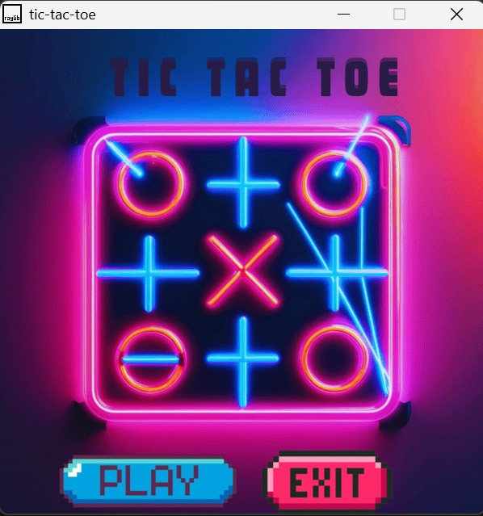
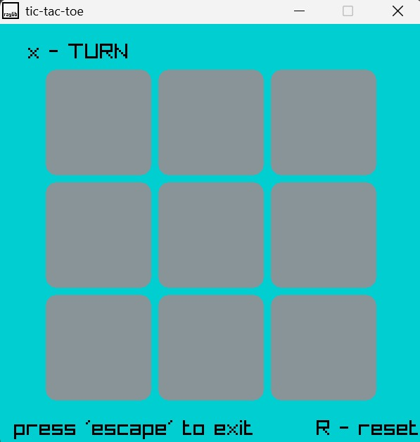
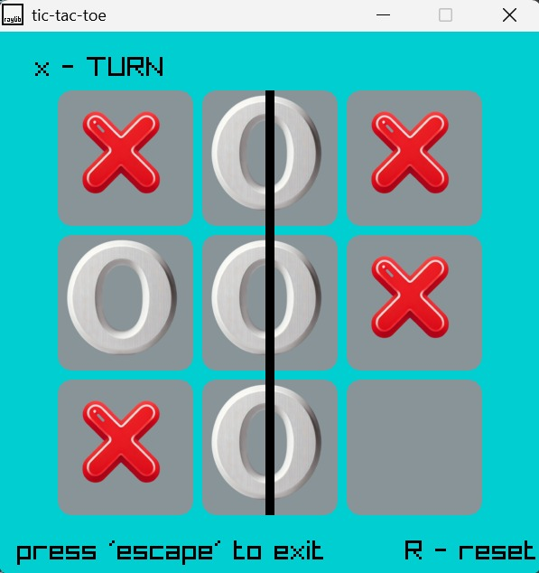
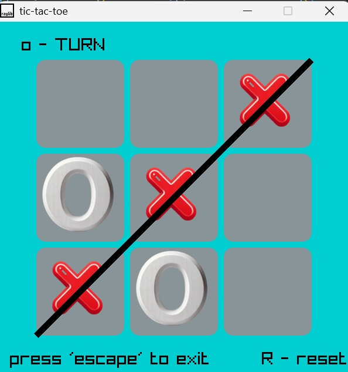

# TIC-TAC-TOE

Tic Tac Toe is game in which two players (X, O), have to arrange (X, O) in 3 by 3 square so that 3X or 3O can form a straight line either vertical or horizontal or diagonal

## HOW TO PLAY

Download the repositary zip by clicking on '<> code' icon in repositary.

After unzipping the file, you will find main.exe, run main.exe file.

Window protection menu will pop up, click on 'more info', then 'run anyway'.
## Screenshots

